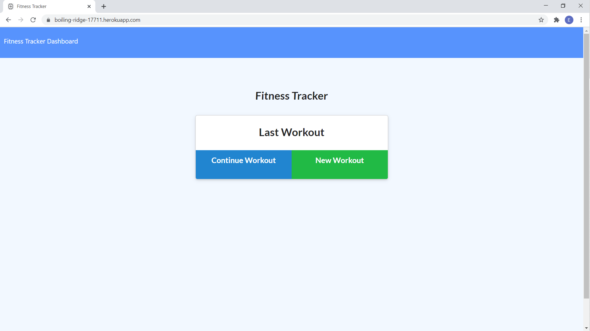
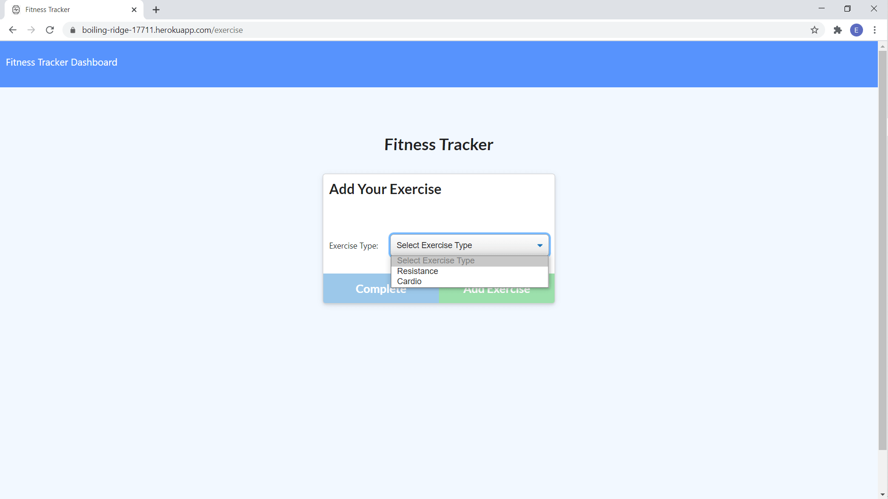
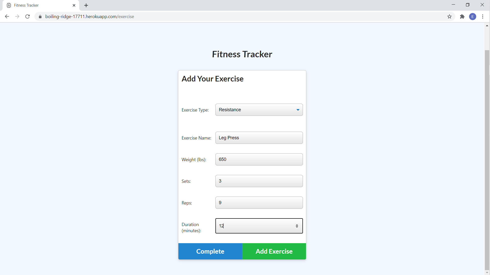
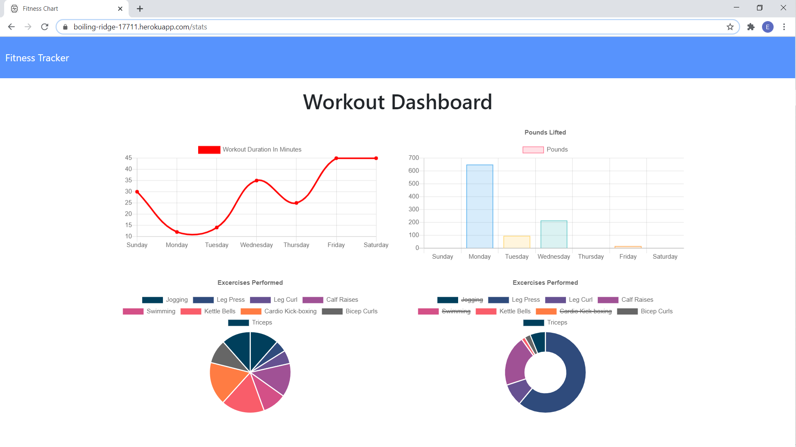

# MongoDB Fitness Tracker

## Project Description

This application uses MongoDB to create a back-end for a web applicaiton that tracks workouts.  Simply enter in the workout type and add it to your workout.

## Table of Contents

* [Title](#project-title)
* [Description](#project-description)
* [Table of Contents](#table-of-contents)
* [Installation](#installation-instructions)
* [Usage](#usage)
* [Contributing](#guidelines-for-contributing)
* [Tests](#tests)
* [Technologies](#technologies-used)
* [Author](#author)
* [Questions](#questions)
* [License](#license)

## Installation Instructions

Users can clone this repository for the source code.  Or, use that app as [deployed on Heroku](https://boiling-ridge-17711.herokuapp.com/).

## Usage 

The Fitness Tracker is [deployed on Heroku](https://boiling-ridge-17711.herokuapp.com/).

With Fitness Tracker users can enter the different exercises that comprise each of their workouts.  From the homepage a user can chose to continue entering information about a previous workout with "Continue Workout", or enter information about a "New Workout".

On the next screen, there is a drop box to select the kind of workout being entered:  Resistance or Cardio.

Depending on the choice of exercise type, the user will be presented with inputs to capture the information pertaining to that particular exercise type.  In the screenshot below, the user has chosen Resistance and is given the inputs necessary to capture a Resistance exercise. 

The workout information entered is stored in a MongoDB database.  The cumulated information is captured in the Fitness Tracker Workout Dashboard to give the user a graphical display of workouts and the exercises that comprised those workouts.

## Guidelines for Contributing

For feature suggestions, or to make a contribution, please e-mail Eric D. Torres at the address provided below.

## Tests

Test early; test often.

### Technologies Used 
### :computer: :computer: :computer: :computer: :computer: :computer: 

#### :memo: HTML5 :memo:

**HTML5** is a markup language used for structuring and presenting content on the World Wide Web.  The goals are to improve the language with support for the latest multi-media and other new features; to keep the language both easily readable by humans and consistently understood by computers and devices; and to remain backward compatible to older software.  Many new symantec features are included.

*HTML5* content borrowed from <a target="_blank" rel="noopener noreferrer">[this page](https://en.wikipedia.org/wiki/HTML5).</a>

#### :art: CSS :art:

**Cascading Style Sheets (CSS)** is a stylesheet language used for describing the presentation of a document written in a markup language (such as HTML5).  CSS is designed to enable the separation of presentation and content; including layout, colors, and fonts.  This separation improves content accessibility to provide more flexibility and control in the specification of presentation characteristics, enabling multiple web pages to share formatting by specifying relevant CSS in a separate file, which reduces complexity and repetition in the structural content (HTML), as well as enabling the file to be cached to improve the page load speed between the pages that share the file and its formatting.

Separation of formatting and content also makes it feasible to present the same markup page in different styles for different rendering methods, such as on-screen, in print, by voice, and on Braille-based tactile devices. 

*CSS* content borrowed from <a target="_blank" rel="noopener noreferrer">[this page](https://en.wikipedia.org/wiki/Cascading_Style_Sheets).</a>

#### :shoe: Bootstrap 4 :shoe:

**Bootstrap 4** is a free and open-source CSS framework directed at responsive, mobile-first front-end web development.  It contains CSS and (optionally) JavaScript-based design templates for typography, forms, buttons, navigation, and other interface components.  

*Bootstrap 4* content borrowed from <a target="_blank" rel="noopener noreferrer">[this page](https://en.wikipedia.org/wiki/Bootstrap_(front-end_framework)).</a>

#### :notebook: Semantic-UI :notebook:

**Semantic UI** is a modern front-end development framework powered by LESS and jQuery.  It has a sleek, subtle, flat design that provides lightweight user experience.  

*Semantic UI* content borrowed from <a target="_blank" rel="noopener noreferrer">[this page](https://www.sitepoint.com/introducing-semantic-ui-component-library/#:~:text=Semantic%20UI%20is%20a%20modern,a%20language%20for%20sharing%20UI%E2%80%9D).</a>

#### :sparkler: JavaScript :sparkler:

**JavaScript (JS)** is one of the core technologies of the World Wide Web (along with HTML and CSS). It enables interactive web pages and is an essential part of web applications.  JS is a multi-faceted, scripting language that provides versatility through Application Programming Interfaces (APIs) and Document Object Model (DOM) manipulation, among others.

*JavaScript* content borrowed from <a target="_blank" rel="noopener noreferrer">[this page](https://en.wikipedia.org/wiki/JavaScript).</a>

#### :globe_with_meridians: NODE.js :globe_with_meridians:

**NODE.js** is an open-source, cross-platform JavaScript runtime environment that execute JavaScript code outside a web browser.  NODE.js lets developers use JavaScript to write command line tools and for server-side scripting.  NODE.js represents a "Javascript everywhere" paradigm, unifying web-application development around a single programming language, rather than different programming languages for server- and client-side scripts.  

*NODE.js* content borrowed from <a target="_blank" rel="noopener noreferrer">[this page](https://en.wikipedia.org/wiki/Node.js).</a>

[Download Node.js](https://nodejs.org/en/).

#### :satellite: Express.js :satellite:

**Express.js** is a minimal and flexible NODE.js web application framework that provides a robust set of features for web and mobile applications.  The myriad HTTP utility methods and middleware allow for the creation of a robust API.  Express.js provides a thin layer of fundamental features, without obscuring NODE.js features.

*Express.js* content borrowed from <a target="_blank" rel="noopener noreferrer">[this page](https://expressjs.com/).</a>

#### :japanese_ogre: MongoDB :japanese_ogre:

**MongoDB** is a document-oriented NoSQL database used for high volume data storage.  Instead of using tables and rows like traditional databases, MongoDB makes use of collections and documents.  Documents consist of key-value pairs that are the basic unit of data and more closely resemble the JSON architecture.    

*MongoDB* content borrowed from <a target="_blank" rel="noopener noreferrer">[this page](https://www.guru99.com/what-is-mongodb.html#:~:text=MongoDB%20is%20a%20document%2Doriented,use%20of%20collections%20and%20documents.&text=Collections%20contain%20sets%20of%20documents,equivalent%20of%20relational%20database%20tables).</a>

### Author 

This *MongoDB Fitness Tracker* was built by :green_heart: Eric D. Torres :green_heart:

## Questions

Check out my [GitHub profile](https://github.com/etorres-revature).

You can contact me by e-mail at etorresnotary@gmail.com for any additional questions and/ or clarifications you may need about the project.

##### License

[This application uses the **MIT License** found here](./LICENSE).

**[This README.md file generated with my NODE.js README Generator app.](https://github.com/etorres-revature/NODEjs_README.md_Generator)**
